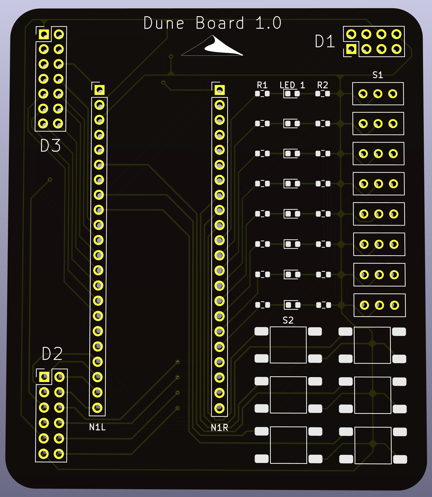

# Dune Board
The Dune Board is an IO board for the Sipeed Tang Nano 4k. This board is mainly intended for FPGA projects using the on board Gowin FPGA. The latest version of the Dune Board (1.0 revision 3) was finalized and manufactured in December 2022 but was uploaded to GitHub January 2024.

Included is a sample VHDL project that utilizes the Dune Board and a 4 digit seven segment display interfaced on D3. This includes a constraint file that specifies how each pin of the Tang Nano 4k connects to the Dune Board. 

### Render of the top side of the Dune Board

### Production Dune Board with the Tang Nano 4k mounted
